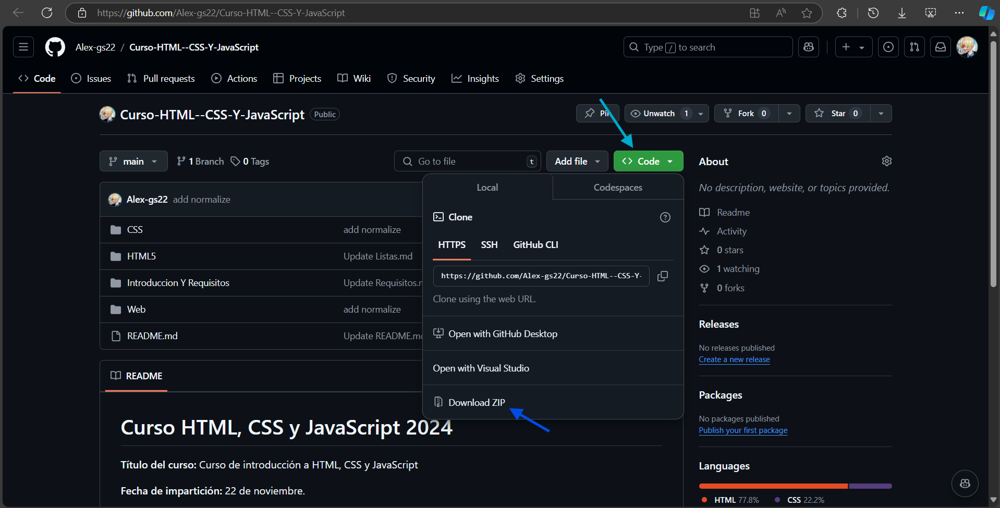
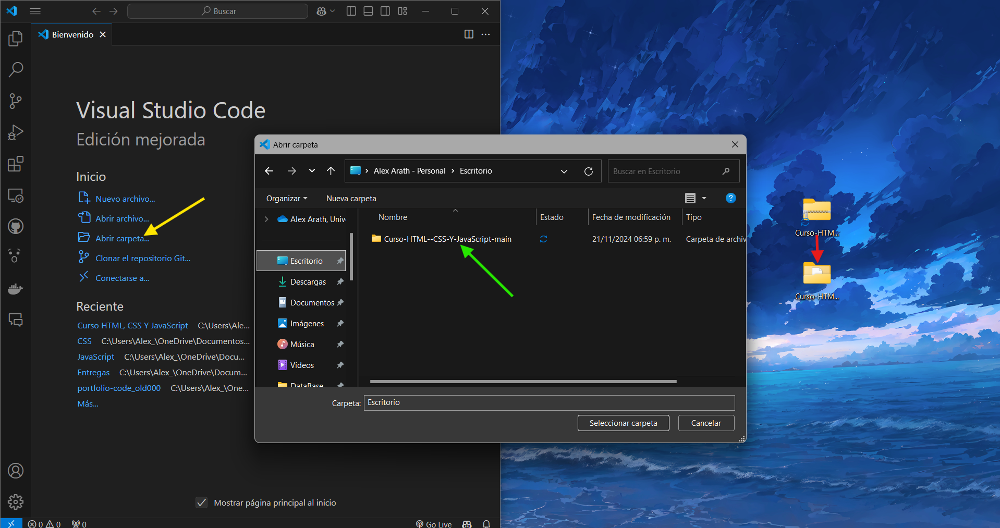

# Requisitos Previos

---

## Herramientas Necesarias

1. **Requerimientos básicos para participar**
   
   - Dispositivo con capacidad para ejecutar Teams.
   - Navegador actualizado (si es necesario para alguna actividad adicional).

2. **Editor de texto o IDE para desarrollo web.**
   ### **Requerido:**
   
   - [Visual Studio Code](https://code.visualstudio.com/)
     
   ### Alternativas:
   
   - Sublime Text
   - Atom

3. **Entorno local para desarrollo web:**
   - Instalación de una extensión de servidor local como [Live Server](https://marketplace.visualstudio.com/items?itemName=ritwickdey.LiveServer) en Visual Studio Code.

4. **Software adicional (Opcional):**
   - Tener instalado [Git](https://git-scm.com/) en tu equipo para gestionar repositorios.
   - Cuenta de [GitHub](https://github.com/) para gestionar el proyecto y guardar cambios.
   - Cuenta de [Supabase](https://supabase.com/) para la creación y conexión con bases de datos.
   - Cuenta de [CloudFlare](https://dash.cloudflare.com/sign-up) para publicar una página web de manera gratuita.

---
## Recursos a Descargarse Previamente

### 1. **Archivos base del curso:**
   - Clonar o descargar el repositorio de GitHub del curso, con la estructura de carpetas y recursos del curso.  
     [Descargar aquí](https://github.com/Alex-gs22/Curso-HTML--CSS-Y-JavaScript).

   ### Paso a paso explicado:

   #### **Paso 1:** Descargar el repositorio como archivo ZIP
   - Abre el repositorio en GitHub.
   - Haz clic en el botón verde `Code` y selecciona `Download ZIP`.
   - Esto descargará un archivo comprimido con todos los recursos del curso.



   #### **Paso 2:** Extraer el archivo ZIP
   - Busca el archivo ZIP descargado en tu computadora y descomprímelo.
   - Esto creará una carpeta con el contenido del curso.

   #### **Paso 3:** Abrir la carpeta en Visual Studio Code
   - Abre Visual Studio Code.
   - Haz clic en "Abrir carpeta" en la pantalla de inicio.
   - Navega hasta la carpeta descomprimida y selecciónala.



---

## Herramientas y Recursos Complementarios

### 1. **Prueba Inicial**

Antes de comenzar con los contenidos del curso, realizaremos una prueba inicial para asegurarnos de que puedes trabajar con los archivos HTML y visualizarlos en tu navegador.

#### **Pasos para la Prueba Inicial**

1. **Crear un archivo básico:**
   - Abre Visual Studio Code o tu editor de texto.
   - Crea un nuevo archivo llamado `index.html`.

2. **Escribe el siguiente contenido:**

   ```html
   <!DOCTYPE html>
   <html lang="es">
   <head>
     <meta charset="UTF-8">
     <meta name="viewport" content="width=device-width, initial-scale=1.0">
     <title>Prueba Inicial</title>
   </head>
   <body>
     <h1>¡Hola Mundo!</h1>
     <p>Este es un ejemplo sencillo para verificar que tu entorno de desarrollo está listo.</p>
   </body>
   </html>
   ```

3. **Guardar el archivo:**
   - Guarda el archivo en una carpeta donde puedas acceder fácilmente.

4. **Abrir el archivo en el navegador:**
   - Haz doble clic en el archivo guardado para abrirlo en tu navegador predeterminado.
   - Deberías ver una página con el texto "¡Hola Mundo!" y un párrafo explicativo.

5. **Verificar el entorno:**
   - Si puedes ver el contenido en tu navegador, significa que estás listo para avanzar con el curso.

---

### Recursos Adicionales

1. [MDN Web Docs](https://developer.mozilla.org/es/) - Documentación oficial sobre HTML, CSS y JavaScript.
2. [W3Schools](https://www.w3schools.com/) - Tutoriales y ejemplos interactivos.
3. [Can I Use](https://caniuse.com/) - Verifica compatibilidad de características en diferentes navegadores.

---

## Contacto

Si tienes dudas antes o durante el curso, puedes contactarme en:
- **Correo:** alexarathgs@gmail.com

¡Nos vemos en el curso! 🎉

---
